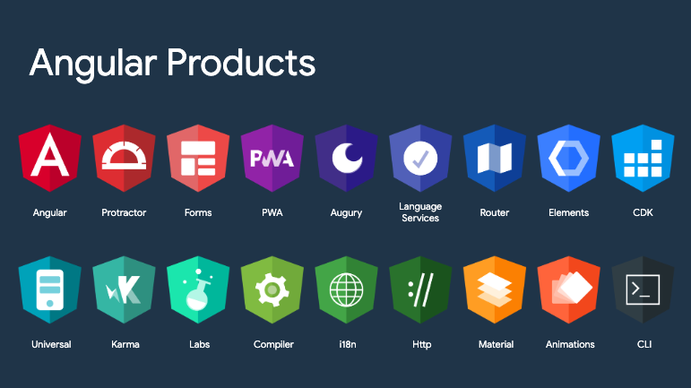

# Pourquoi Angular ?

## Angular est un framework

Contrairement à d'autres alternatives intéressantes telles que [React](https://reactjs.org/), Angular n'est pas une "library" mais bien un framework avec une approche "batteries included".

Angular fournit donc nativement tout le nécessaire pour produire une application entière avec une configuration standard :

* **Configuration** de build et d'optimisation **complète**.
* Module d'**animations**.
* Module de "**routing**".
* Module de **formulaires**.
* **Debug**.
* **Tests unitaires** et **e2e**.
* ...

Il n'est donc pas nécessaire d'hésiter et de débattre le choix des modules de routing, de formulaires etc...

Avec Angular, la majorité des applications ont la même structure de projet et la même "stack" d'outils.  
**Les applications Angular sont donc homogènes** et vous tomberez donc plus rarement sur des "cas particuliers".

Dans la plupart des cas, vous éviterez les problèmes de compatibilité de dépendances en laissant l'équipe Angular s'en charger pour vous.

En contrepartie, voici un exemple de mise en place d'un "preprocessor" sass sur une app React:

Heureusement, les choses ont évolué depuis grâce à [create-react-app](https://facebook.github.io/create-react-app/) & react-scripts.

### Point de vue de Vue.js concernant Angular

Source:  [https://vuejs.org/v2/guide/comparison.html\#Flexibility](https://vuejs.org/v2/guide/comparison.html#Flexibility)

## TypeScript

Angular profite de la **rigueur et flexibilité** du langage TypeScript.

## Single-Page App & Progressive Web App

Angular fournit nativement le nécessaire pour produire des **Progressive Web Apps**.

On peut donc rapidement produire des applications webs donnant l'illusion d'une application native tout en restant résilient aux problèmes de connexion.

L'idée est de voir le web comme des applications interreliées plutôt que des sites web contenant des pages.



## Abstraction

Angular fournit des couches d'abstraction à tous les niveaux. Cela évite par exemple de manipuler directement le DOM.

## Mobile

Par défaut, Angular repose sur la couche `PlatformBrowser` pour communiquer avec le DOM.

D'autres alternatives de cette couche existent pour utiliser Angular dans d'autres contextes :

* `PlatformNativeScript` : Utilisation de Native Script pour faire le bridge entre le code Angular et le code natif Android ou IOS. [https://docs.nativescript.org/angular/start/introduction](https://docs.nativescript.org/angular/start/introduction)
* `PlatformServer` : Pour générer le rendu HTML côté serveur _\(Server Rendering\)_. [https://universal.angular.io/](https://universal.angular.io/)
* Ionic qui permet de produire des applications natives contenant des "web views" Angular [https://ionicframework.com/docs/](https://ionicframework.com/docs/)

## Separation of concerns

Angular permet de mieux séparer les responsabilités avec une approche MVC _\(Model / View / Controller\)_ et l'injection de dépendances.

## Ecosystème très riche et large communauté

Exploitation des 5 ans d'existence d'AngularJS et des retours de la communauté pour rectifier les erreurs de conception, faciliter le développement et gagner en performance et stabilité.

## Testabilité comme priorité

Angular fournit tous les outils nécessaires pour faciliter l'implémentation des tests unitaires et de tests e2e.

* Configuration clé en main des outils de test, du reporting, du coverage etc...
* Mocks des modules http et routing.
* Protractor : surcouche de Selenium adaptée pour faciliter les tests end-to-end Angular avec intégration native de la parallélisation et d'outils tels que [BrowserStack](https://www.browserstack.com/) et [SauceLabs](https://saucelabs.com/).

## Architecture et maintenabilité

AngularJS était très flexible. Sans bonnes pratiques, les applications perdent très rapidement en stabilité et en maintenabilité.

Angular impose **une approche mieux structurée** à base de composants et une façon plus clair d'échanger les données entre les composants.

Angular encourage une **implémentation générique \(**_**"framework agnostic"**_**\)** permettant de réutiliser plus facilement du code Angular dans d'autres contextes.

## Performance

Angular est un **framework** très **déclaratif**. Cela peut sembler fastidieux au départ mais cette approche permet à Angular de mieux comprendre le fonctionnement de l'application avant son exécution permettant alors d'optimiser la construction de l'application, par exemple en éliminant automatiquement le code inutile.

Au fil des mises à jour d'Angular, vous obtiendrez donc des applications de plus en plus performantes sans changer votre code ou à la rigueur en éliminant les usages dépréciés.

## Angular Release Schedule & Long-Term Support

L'équipe Angular s'engage à publier une **nouvelle version majeure tous les 6 mois** _\(correspondant aux deux grandes conférences mondiales en Mai \[_[_NgConf_](https://www.ng-conf.org/)_\], et en Novembre \[_[_Angular Connect_](http://angularconnect.com/)_\] \)_.

* **Angular 2** : Septembre 2016
* **Angular 4** : Mars 2017
* **Angular 5** : Novembre 2017
* **Angular 6** : 3 mai 2018 _\(Angular CLI, Angular Material, Flex Layout etc... synchronisent leurs versions également\)_
* **Angular 7** : 18 octobre 2018

Chaque version est **maintenue pendant 18 mois** et reste compatible avec les fonctionnalités de la version précédente qui deviennent dépréciées.

[https://github.com/angular/angular/blob/master/docs/RELEASE\_SCHEDULE.md](https://github.com/angular/angular/blob/master/docs/RELEASE_SCHEDULE.md)

### A propos d'AngularJS

AngularJS correspond à la version 1.x Il ne faut pas confondre AngularJS et Angular. Bien que le numéro de version 2.x semblerait indiquer une continuité avec la version 1.x de Angular, il s'agit d'une refonte intégrale du Framework.

La dernière version de AngularJS, **AngularJS 1.7**, la dernière version de AngularJS est sortie en Mai 2018 et rentre en Long-Term Support \(LTS\) à partir du **1er Juillet 2018** jusqu'au **30 juin 2021**.

